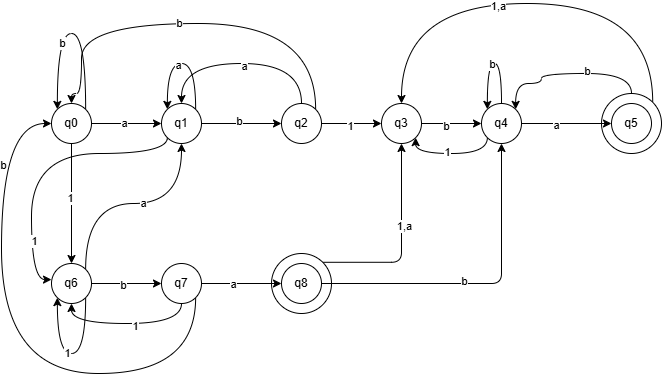

# Implementation-of-Lexical-Analysis
## Description
For this evidence, the language chosen was all the possible combinations of ab1. 
The rules were the following: 
- Must have ab1 or 1ba
- Must end with ba.
The **modeling tecnique** used was a Deterministic Finite Automata (DFA) to represents my solutions. DFA was develop because of the predictable and deterministic behavior in its definition presented in (NFA Vs: DFA: Unraveling the Differences in Finite Automaton Models - FasterCapital, 2025) By the rules required in the lexical analysis, the DFA was implemented to assure that the AUTOMATA fulfilled the necessary processes.

## Model Of the Solution
These is the automata I generated for the language.
 
I decided to represent my chosen language in a DFA so that the transition to program the Automata in prolog was easier to follow. If I were to use a NFA, the process of implementation would be harder. The analysis between them was followed by the resume given in (GeeksforGeeks, 2025).

### References 
Peckory, G. (2015, December 1). Why use NFAs over DFAs. Stack Overflow. https://stackoverflow.com/questions/33260936/why-use-nfas-over-dfas
GeeksforGeeks. (2025, July 12). Difference between DFA and NFA. GeeksforGeeks. https://www.geeksforgeeks.org/theory-of-computation/difference-between-dfa-and-nfa/
NFA vs: DFA: Unraveling the Differences in Finite Automaton Models - FasterCapital. (2025, April 6). FasterCapital. https://fastercapital.com/content/NFA-vs--DFA--Unraveling-the-Differences-in-Finite-Automaton-Models.html
